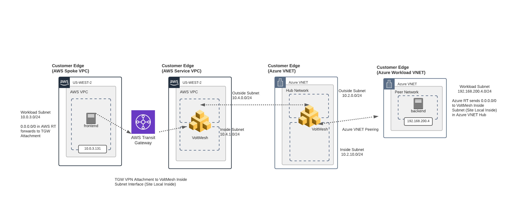

Lab8: AWS TGW Networking and Site Mesh
======================================

.. note:: 
    This is an optional exercise.  This can be as a replacement for Lab 2, but it does required that you've done Lab 4 and either Lab 6 or 7

During this lab you will use VoltConsole to

- Create an AWS "Spoke" VPC
- Create an AWS TGW Site
- Add a spoke AWS VPC as a TGW Attachment
- Setup "Site Mesh" between the Sites

.. toctree::
   :maxdepth: 1
   :caption: Contents:

   spoke-vpc
   tgw-site
   site-mesh